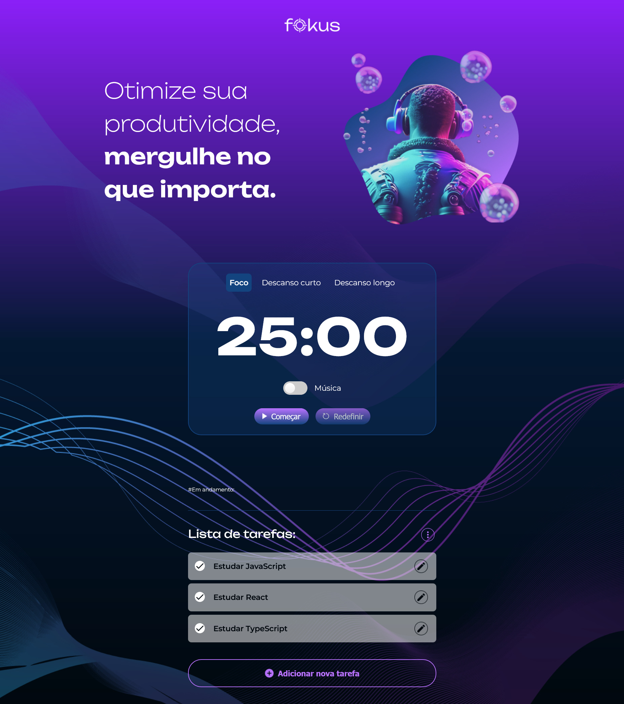

# ⏳ Fokus Timer
## Pomodoro + Task Manager com JavaScript Moderno (ES Modules)

Aplicação web de produtividade baseada na **Técnica Pomodoro**, combinando **gerenciamento de tarefas** e **arquitetura modular em JavaScript puro (ES6+)**.

O projeto foi desenvolvido com foco em **estrutura escalável, separação de responsabilidades e controle de estado**, simulando a organização de aplicações reais sem uso de frameworks.


---

## 📝 Sumário

- [Sobre o Projeto](#-sobre-o-projeto)
- [Preview do Projeto](#-preview-do-projeto)
- [Funcionalidades](#-funcionalidades)
- [Conceitos e Arquitetura](#-conceitos-e-arquitetura)
- [Estrutura do Projeto](#-estrutura-do-projeto)
- [Como Executar o Projeto](#como-executar-o-projeto)
- [Aprendizados](#-aprendizados)
- [Melhorias Futuras](#-melhorias-futuras)
- [Créditos](#-créditos)
- [Licença](#-licença)
- [Autor](#-autor)

---

## 🌐 Acesso ao Projeto
Você pode visualizar e testar o projeto facilmente pelo link:

- **👉 Deploy no GitHub Pages:**
[Acesse o projeto](https://mguilhermegomes.github.io/fokus-timer/)

---

## 📌 Sobre o Projeto

O **Fokus Timer** integra dois pilares da produtividade:
- ⏳ Um **Timer Pomodoro** com múltiplos contextos
- 📝 Um **Gerenciador de Tarefas** sincronizado com o ciclo de foco

Ao finalizar um ciclo de foco, a tarefa ativa pode ser automaticamente marcada como concluída, promovendo uma experiência contínua e orientada a resultado.

O projeto foi construído utilizando apenas **Vanilla JavaScript**, priorizando clareza arquitetural e organização modular.

---

## 👀 Preview do Projeto


---

## ✨ Funcionalidades
### ⏳ Timer Pomodoro
- Contagem regressiva
- Modos de:
    - Foco
    - Descanso curto
    - Descanso longo
- Iniciar, pausar e continuar
- Reinício automático conforme contexto
- Feedback sonoro (início, pausa e término)
- Música ambiente opcional durante o foco

### 🎯 Controle de contexto
- Alteração dinâmica de:
    - Imagem
    - Título
    - Tema visual
- Ajuste automático da duração do timer
- Interface adaptada para cada modo

### 📝 Gerenciamento de tarefas
- Criar novas tarefas
- Editar tarefas existentes
- Ativar uma tarefa para foco
- Marcar tarefas como concluídas automaticamente ao finalizar o ciclo de foco
- Remover tarefas concluídas
- Limpar todas as tarefas
- Scroll automático para novas tarefas

### 💾 Persistência de dados
- As tarefas são salvas automaticamente no navegador
- Ao recarregar a página, o estado das tarefas é mantido

---

## 🧠 Conceitos e Arquitetura

O projeto foi estruturado com foco em organização, isolamento de responsabilidades e previsibilidade de estado.

### 🔹 Arquitetura Modular
- ES Modules (import/export)
- Separação clara entre domínios (pomodoro, tasks, global)
- Comunicação controlada entre módulos
- Organização escalável sem frameworks

### 🔹 Gerenciamento de Estado
- Controle centralizado do estado do timer
- Gerenciamento da tarefa ativa
- Interface reativa baseada em estado
- Atualizações previsíveis da UI

### 🔹 Manipulação de Dados
- Persistência com LocalStorage
- Serialização e Desserialização com JSON
- Sincronização entre estado e armazenamento

### 🔹 DOM & Eventos
- Manipulação avançada do DOM
- Eventos customizados
- Controle de interface baseado em contexto

---

## 🛠 Tecnologias Utilizadas
- 
- 
- 
- 
- 
- 
- 

---

## 🚧 Desafios Técnicos
Durante o desenvolvimento, alguns desafios enfrentados foram:

- Sincronizar o estado do timer com a tarefa ativa
- Evitar acoplamento excessivo entre módulos
- Garantir persistência consistente no LocalStorage
- Atualizar dinamicamente a interface com base no estado global
- Manter escalabilidade sem uso de frameworks

---

## 📂 Estrutura do Projeto
```text
app
 ├── mainPomodoro.js
 ├── mainTasks.js
 │
 ├── global
 │   ├── habilitarDesabilitarBtn.js
 │   └── scrollToEnd.js
 │
 ├── pomodoro
 │   ├── activeButton.js
 │   ├── musicControl.js
 │   │
 │   ├── contexto
 │   │   ├── alterarContexto.js
 │   │   ├── atualizarInterface.js
 │   │   └── contextoConfig.js
 │   │
 │   └── timer
 │       ├── iniciarEPausar.js
 │       ├── timerControl.js
 │       ├── timerConfig.js
 │       └── atualizarERedefinirBtnTimer.js
 │
 └── tasks
     ├── criarElementoTarefa.js
     ├── editarTarefa.js
     ├── exibirTarefas.js
     ├── ativarDesativarTarefas.js
     ├── removerTarefas.js
     ├── salvarNoLocalStorage.js
     └── tarefasConfig.js
```

Essa organização permite:
- Alta coesão por domínio
- Baixo acoplamento entre módulos
- Facilidade de manutenção
- Escalabilidade futura

---

## ▶ Como Executar Localmente

### 1. Clone o repositório
```bash
git clone https://github.com/mguilhermegomes/fokus-timer.git
```

### 2. Acesse a pasta
```bash
cd fokus-timer
```

### 3. Execute
Abra o arquivo ``index.html`` ou utilize a extensão **Live Server** no VS Code.

> Nenhuma instalação adicional é necessária.

---

## 📚 Aprendizados

Este projeto reforçou e aprofundou conhecimentos em:

- Estruturação de aplicações JavaScript
- Arquitetura modular sem frameworks
- Gerenciamento de estado
- Fluxo de eventos em aplicações interativas
- Persistência de dados no navegador
- Organização escalável de código front-end

---

## 🔮 Melhorias Futuras
Possíveis evoluções do projeto:
- Estatísticas de produtividade
- Histórico de ciclos concluídos
- Dark mode persistente
- Armazenamento em API externa
- Testes automatizados

---


## 🎨 Créditos

Layout e design fornecidos pela Alura para fins educacionais.  
A implementação JavaScript foi desenvolvida por **Guilherme Gomes**.

---

## 📄 Licença

O código JavaScript deste projeto está licenciado sob a MIT License.

Os arquivos de HTML, CSS e os assets de design foram fornecidos pela Alura para fins educacionais e podem estar sujeitos aos termos da plataforma.

## 👨‍💻 Autor

**Guilherme Gomes**.  
Desenvolvedor focado em JavaScript moderno e arquitetura front-end.

🔗 LinkedIn: <https://www.linkedin.com/in/mguilherme-gomes/>  
🔗 GitHub: <https://github.com/mguilhermegomes>
